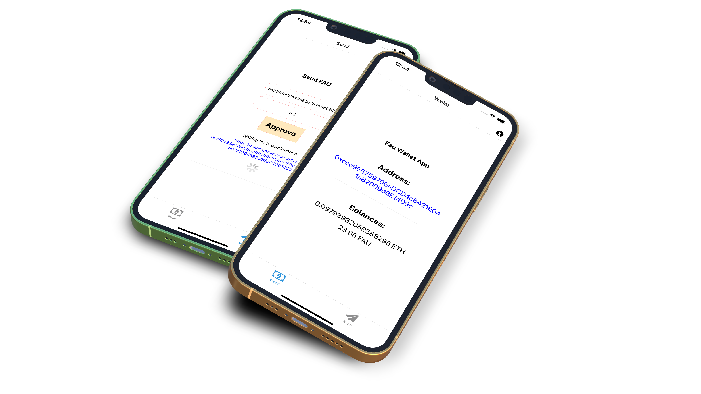

# `Token Wallet Example App`


## Getting started

First,  please make sure you have [`expo-cli`](https://docs.expo.io/workflow/expo-cli/) installed.

```
npm install -g expo-cli
```

To install all dependencies, enter:

```
yarn install
```

To start the app, you can enter:

```
yarn start
```

## ✌️ Screenshots

